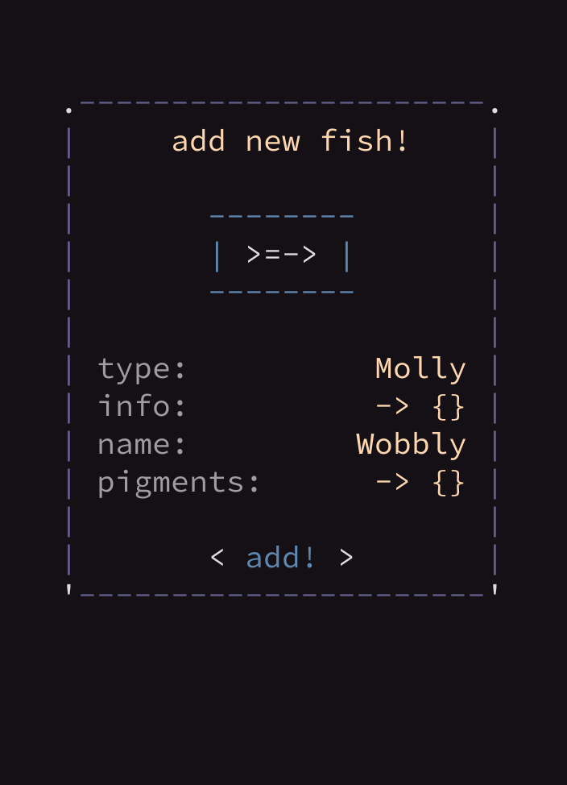
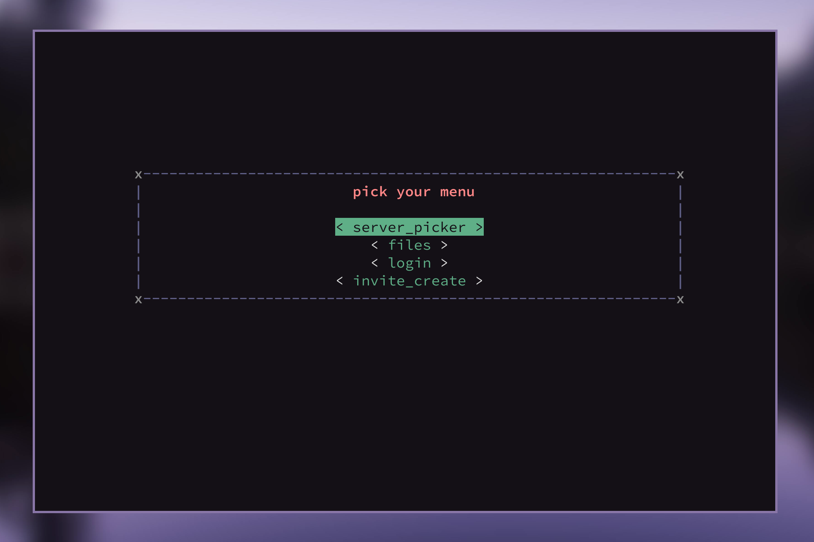
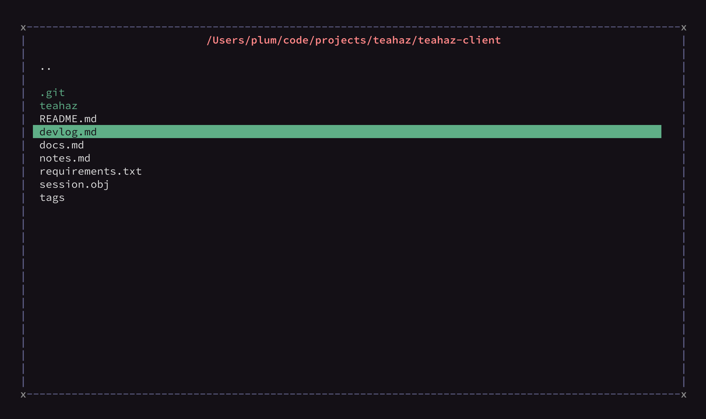

pytermgui
=========

A simple module to display UI in the terminal, as well as to read input.

For now, a good example of use would be [teahaz-client](https://github.com/bczsalba/teahaz-client), but documentation will be coming soon.


getting started
----------------
```py
from pytermgui import Container,container_from_dict,getch

data = {
    "ui__title": "Test data",
    "key": "value",
    "key2": "value"
    "ui__button": {
        "id": "test-data_button",
        "value": "publish!"
    }
}

c = container_from_dict(data)
c.select()
print(c)

while True:
    key = getch()

    if key == "ARROW_UP":
        c.selected_index -= 1

    elif key == "ARROW_DOWN":
        c.selected_index += 1

    c.select()
    print(c)
```

images
--------
<p align=center>
    </img>
</p>


