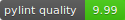

<!-- TODO: these colors could be randomly generated -->


> A simple yet powerful TUI framework for your Python (3.9+) applications
```
pip3 install pytermgui
```
[](https://badge.fury.io/py/pytermgui)
[](https://github.com/bczsalba/pytermgui/blob/master/utils/create_badge.py)

Core principles
---------------

<!-- Look into rewording this one -->
`PTG` was written with some core ideas in mind, such as:
- Pythonic syntax
- Flexible systems
- Extensibility by design
- Readable, reproducible code

```python
from pytermgui import Container, Label
root = Container() + Label("Clean code is [bold]cool[/bold]!")
root.print()
```

What we provide
---------------

- Terminal mouse support
- A fully flegded [WindowManager](https://github.com/bczsalba/pytermgui/blob/master/pytermgui/window_manager.py) in the terminal
- A cross-platform [getch](https://github.com/bczsalba/pytermgui/blob/master/pytermgui/input.py) function with key translations
- An [interface](https://github.com/bczsalba/pytermgui/blob/master/pytermgui/ansi_interface.py) to most terminal functionality
- A custom markup language with definable tags & macros inspired by [Rich](https://github.com/willmcgugan/rich/tree/master/rich)
- [Tokenizer & optimizer](https://github.com/bczsalba/pytermgui/blob/master/pytermgui/parser.py) methods for ANSI-sequence strings
- A robust, extensible and customizable [Widget](https://github.com/bczsalba/pytermgui/blob/master/pytermgui/widgets) class
- helpful [CLI tools](https://github.com/bczsalba/pytermgui/blob/master/pytermgui/cmd.py) (`ptg --help`)
- Helpful [example files](https://github.com/bczsalba/pytermgui/blob/master/pytermgui/cmd.py) covering most of the library

```python
import sys
from pytermgui import WindowManager, Window, Label, Button

manager = WindowManager()
window = (
    Window()
    + Label("[210 bold]My first Window!")
    + Label()
    + Label("[157]Try resizing the window by dragging the right border")
    + Label("[157]Or drag the top border to move the window")
    + Label("[193 bold]Alt-Tab[/bold 157] cycles windows")
    + Label("[193 bold]CTRL_C[/bold 157] exits the program")
    + Label()
    + Button("New window", onclick=lambda *_: manager.add(window.copy().center()))
    + Button("Close current", onclick=lambda _, button: button.parent.manager.close(button.parent))
    + Button("Exit program", onclick=lambda *_: sys.exit(0))
)

window.min_width = 55
manager.add(window)
manager.run()

```

<!-- TODO: Figure out a better quality for this -->


Example to get started with
---------------------------
```python
from pytermgui import Widget, Container, Label, InputField, MarkupFormatter, getch, alt_buffer, boxes

border_corner_markup = MarkupFormatter("[60 bold]{item}")
Container.set_style("border", border_corner_markup)
Container.set_style("corner", border_corner_markup)
boxes.SINGLE.set_chars_of(Container)

root = Container()
root.forced_width = 70

boxes.DOUBLE_TOP.set_chars_of(root)
root += Label("[210 bold] Welcome to [italic]PyTermGUI!", parent_align=Widget.PARENT_LEFT)
root += Label()

field = InputField("Enter something!")
field.set_style("value", MarkupFormatter("[italic 72]{item}"))
field.set_style("cursor", MarkupFormatter("[@72]{item}"))

field_container = Container() + field
field_container.forced_height = 7
root += field_container

root += Label("[245 italic]> Press CTRL_C to exit...", parent_align=Widget.PARENT_RIGHT)

root.focus()

with alt_buffer(cursor=False):
    root.center()
    root.print()

    while True:
        key = getch(interrupts=False)

        if key == chr(3):
            break

        field.send(key)
        root.center()
        root.print()

print("Goodbye!")
```
[](#example-to-get-started-with)

Some screenshots
----------------

[](https://github.com/bczsalba/pytermgui/blob/master/examples/hello_world.py)
[](https://github.com/bczsalba/pytermgui/blob/master/examples/bezocalc.py)

Why the ~~long nose~~ version requirement?
------------------------------------------

`PyTermGUI` makes heavy use of the typing module, which in Python 3.9 saw the inclusion of container parameterizing, allowing the use of `list[str]` instead of `List[str]`.

The previous method is now deprecated, and there isn't any nice way of supporting both forever. As such, the use of the new syntax makes Python 3.8x and lower raise `SyntaxError`.

There isn't really much to help this issue, and its good practice to stay on the most recent release regardless.

```python
from pytermgui import Container, Label, boxes, auto
boxes.EMPTY_VERTICAL.set_chars_of(Container)

root = Container()
root += Label("[246 italic bold] a guide on the python version you should use")

root += auto({
    "[157]python >3.9": "[157]good",
    "[210]python <3.8": "[210]bad",
})
root.print()
```


Documentation
-------------

As the project is in its infancy, dedicated documentation is not yet available. 

If you are interested in help about anything the module provides, you can read its docstring:
```bash
python3 -c "help(<name>)"
```

However, proper documentation is coming soon.
