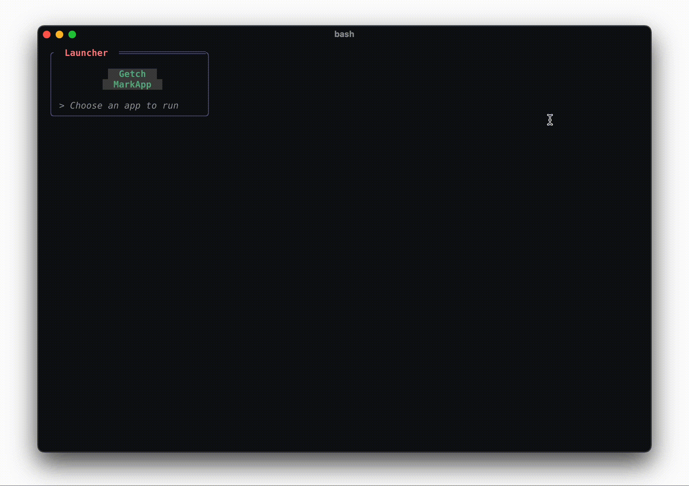
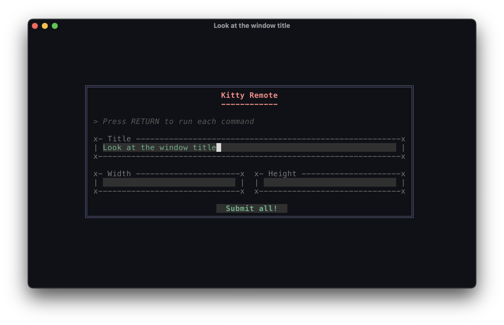

# pytermgui usage examples

## The pytermgui CLI interface

> A WindowManager with its own Application system to allow the user to launch & use utility applications

## Hello world

> A simple window showing off markup and YAML file loading. run `ptg -f examples/hello_world.yaml` to see.

## Kitty Remote

> A frontend for some of the kitty terminal CLI

