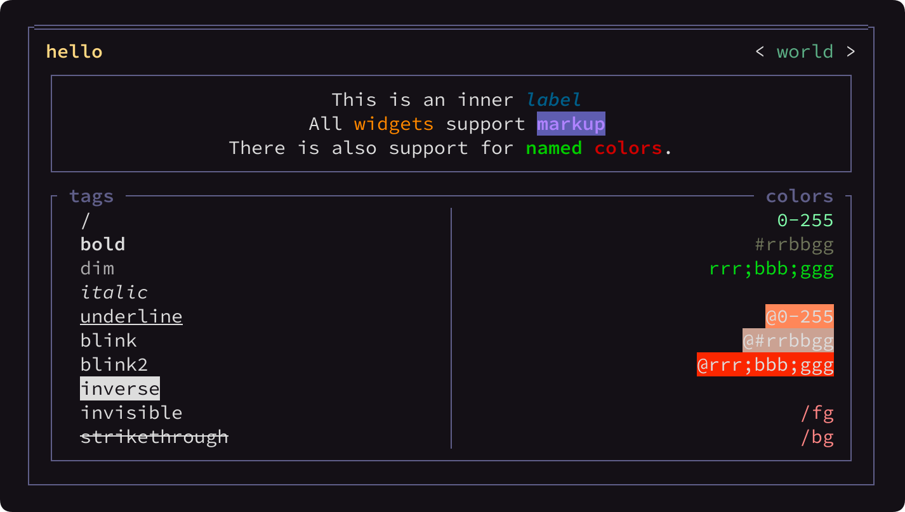
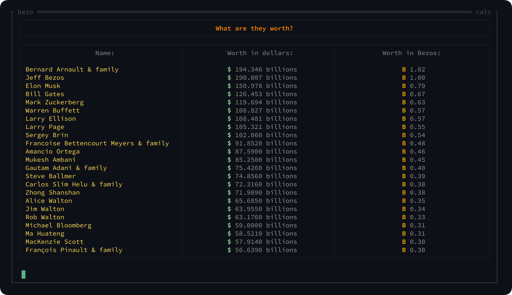

pytermgui usage examples
========================

### Disclaimer:
Some of these files were written a long time ago, and as the API changes there is no guarantee they will work. They still show off some of the library's capabilities however, and we try to keep them up-to-date.

The pytermgui CLI interface
---------------------------

> A WindowManager with its own Application system to allow the user to launch & use utility applications

Hello world
-----------

> A Container to showcase a majority of the library's markup capabilities

BezoCalc
--------

> An application the list the world's wealthiest people in terms of Jeff Bezos' wealth

